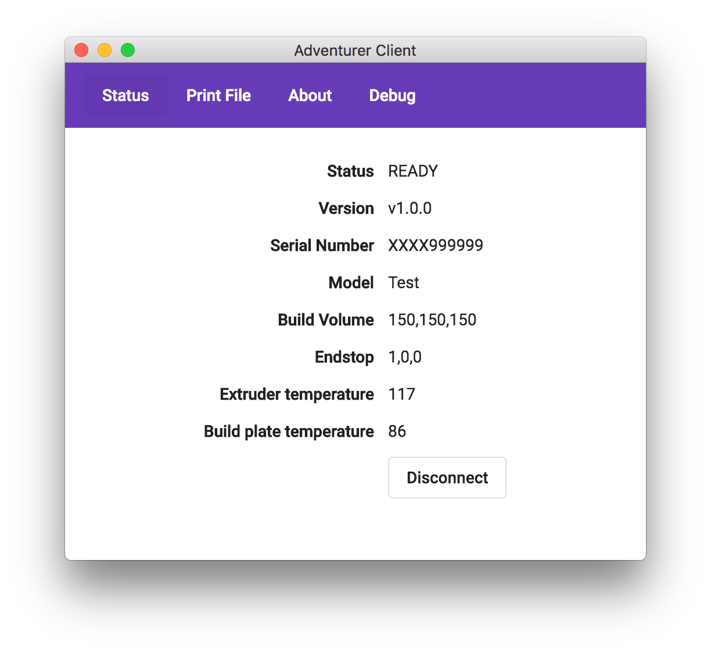

# AdventurerClientJS
A cross platform application for communicating with the FlashForge Adventurer and Monoprice Voxel 3D Printer.

## Building
1) Install [NodeJS](https://nodejs.org)
1) In a command prompt change to the `src` directory
1) Run `$ npm install`
1) Run `$ npm run electron`

## Fake Printer
To simplify development and testing, a fake printer is included that will return realistic data to the client. To run it:
1) In a command prompt change to the `stubPrinter` directory
1) Run `$ node stubPrinter.js`
1) In the client connect to "localhost' to use the fake printer

## Errors
### “Adventurer Client” cannot be opened because the developer cannot be verified.
Unfortunately, Apple require that app software running on macOS be signed and Notarized so that they can verify its identity. Doing this would require me to buy a code signing certificate and an Apple Developer license which is quite expensive. Therefore, for the time being, the app is distributed unsigned. To run the app you need to perform the following steps, for the first run only.

1) Double click on "Adventurer Client"
1) At the _“Adventurer Client” cannot be opened because the developer cannot be verified._ message, click cancel
1) Right click on the app and click open
1) At the _macOS cannot verify the developer of “Adventurer Client”. Are you sure you want to open it?_ message, click Open

## Running
Windows and Mac builds are available in [releases](https://github.com/andycb/AdventurerClientJS/releases). Note, the builds are not signed, so will generate an OS warning when first run.

## TODO
- ⏺ Support for more functions
- ⏺ Support command line arguments
- ⏺ Unit tests
- ⏺ Sign & Notarize binaries to avoid warnings.
